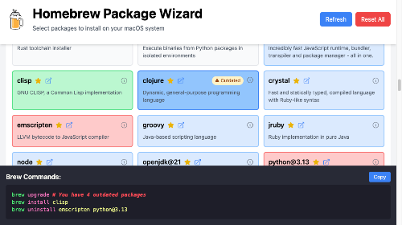

# Brewiz - Homebrew Package Wizard

Brewiz is a modern web interface for managing Homebrew packages on macOS. It provides an intuitive way to browse, select, and generate Homebrew commands for package installation and management.

[](docs/images/brewiz-full.png)

## Features

- 🎯 Visual package selection interface
- 📦 Browse packages by categories
- 🔄 Real-time command generation
- 🚀 One-click copy of commands
- 💫 Responsive design
- 🎨 Visual status indicators for installed/outdated packages

## Usage

The easiest way to use Brewiz is to add the following alias to your shell configuration file (e.g., `~/.zshrc`) and then run `brewiz` in your terminal:

```bash
alias brewiz='/usr/bin/ruby -e "$(curl -fsSL https://raw.githubusercontent.com/wstein/brewiz/refs/heads/main/brewiz)" --'
```

Alternatively, you can download the script from GitHub and run it directly:

```bash
curl -fsSL -O brewiz https://raw.githubusercontent.com/wstein/brewiz/refs/heads/main/brewiz
chmod +x brewiz
./brewiz
```

The Script will start the Brewiz server and open the application in your default browser. If the browser does not open automatically, you can navigate to `http://localhost:8047` manually. The Brewiz server will run in the background until you stop it.

Now you can browse the available packages, select the ones you want to install, and copy the generated command to your terminal.


## Development

### Prerequisites

- Node.js (v18 or higher)
- bun as package manager (optional)

### Setup

1. Clone the repository:

```bash
git clone https://github.com/wstein/brewiz.git
cd brewiz
```

2. Install dependencies:

```bash
# Using Bun
bun install

# Or using npm
npm install
```

3. Start the development server:

```bash
# Using Bun
bun dev

# Or using npm
npm dev
```

The application will be available at `http://localhost:8048`

### Building for Production

To create a production build:

```bash
# Using Bun
bun run build

# Or using npm
npm build
```

The built files will be in the `dist` directory.

## Usage

### Starting the Application

Brewiz can be started in different modes:

```bash
# Start both backend and frontend in production mode
brewiz

# Start in development mode (hot reloading enabled)
brewiz --dev
```

### Command Line Options

```text
Options:
Usage: brewiz [options]
    -d, --dev                        Enable development mode
    -a, --address ADDRESS            Address to run Server on
    -p, --port PORT                  Port to run Server on
        --dev-port PORT              Frontend Dev Server port
        --packages-url URL           URL to package list
        --packages-file PATH         Path to local package list
        --no-open                    Don't open browser automatically
    -h, --help
```

### Development Mode

When started with `--dev`:

- Frontend hot module replacement (HMR) is enabled
- Backend file watching for automatic restarts
- Source maps are enabled
- Development tools and logging are activated

### Production Mode

In production mode:

- Static files are loaded from the github repository
- Frontend is optimized for production

## Tech Stack

- [SolidJS](https://www.solidjs.com/) - Frontend framework
- [Tailwind CSS](https://tailwindcss.com/) - Styling
- [Vite](https://vitejs.dev/) - Build tool

## License

This project is licensed under the MIT License - see the [LICENSE](LICENSE) file for details.
